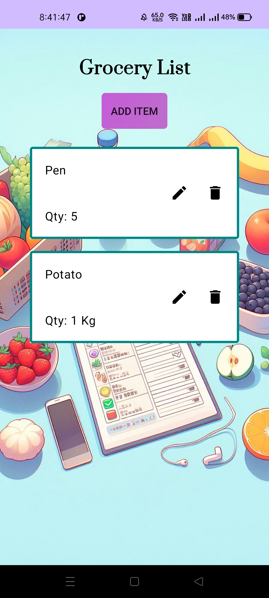
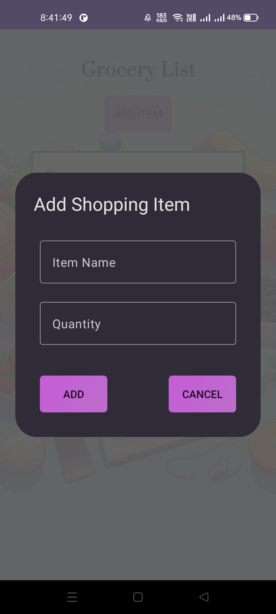
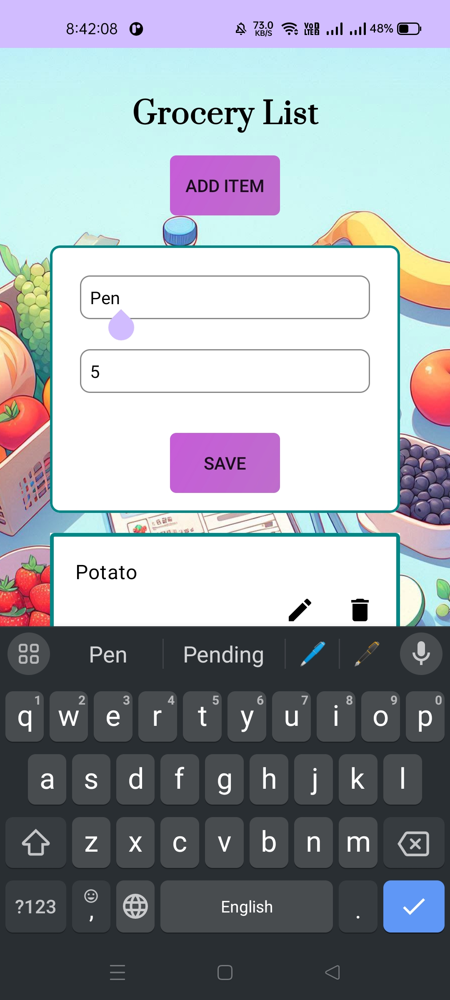

# Shopping List App

## Introduction

Welcome to the Shopping List App! This application helps you create and manage shopping lists efficiently. Add, edit, and delete items from your shopping list with ease.

## Features

1. Create multiple shopping lists
2. Add, edit, and delete items in each list
3. Mark items as purchased
4. User-friendly and responsive design

## Usage

1. Open the app on your Android device.
2. Create a new shopping list.
3. Add items to your shopping list.
4. Edit or delete items as needed.
5. Mark items as purchased when you buy them.

## Screenshots

|  |  |  |
| --------------------------------------------- | --------------------------------------------- | --------------------------------------------- |

## Technologies Used

- Kotlin
- Android SDK
- Room Database
- RecyclerView
- Material Design

## Contributing

Contributions are welcome! Please follow these steps to contribute:

1. **Fork the repository**
2. Create a new branch (`git checkout -b feature/your-feature`).
3. Make your changes.
4. Commit your changes (`git commit -m 'Add some feature'`).
5. Push to the branch (`git push origin feature/your-feature`).
6. Open a pull request.

## Contact

For any inquiries, please contact:

- Your Name - [your.email2felixfelix@gmail.com](mailto:your.email2felixfelix@gmail.com)
- GitHub: [AnandY4d4v](https://github.com/AnandY4d4v)
